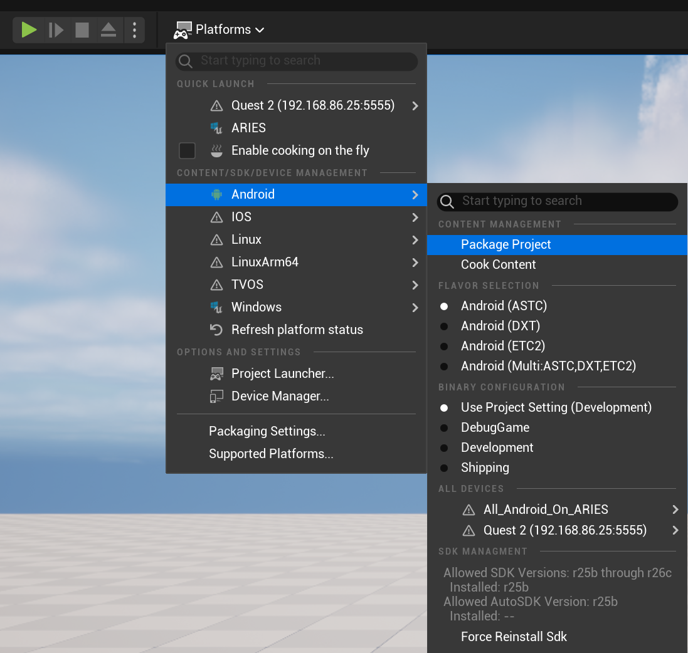

# VR Lab

- [VR Lab](#vr-lab)
  - [About](#about)
  - [Goals](#goals)
  - [Current Functionality](#current-functionality)
    - [Virtual Reality](#virtual-reality)
    - [Desktop](#desktop)
  - [Installing Android Studio](#installing-android-studio)
  - [How to Build for the Meta Quest](#how-to-build-for-the-meta-quest)
    - [Developer Mode](#developer-mode)
    - [Configure for Android](#configure-for-android)
    - [Package for Android](#package-for-android)
    - [Deploy to the Quest](#deploy-to-the-quest)
  - [Troubleshooting](#troubleshooting)
    - [Delete old APK](#delete-old-apk)

## About

A simple Unreal Engine 5.4 Virtual Reality Project

## Goals

- To demonstrate how to configure a Unreal Engine project to run in VR and on the Meta Quest.
- To experiment with various VR interactions and features.

## Current Functionality

- Start in either VR or Desktop mode, depending if a HMD is connected.

### Virtual Reality

- Forward source is set to the left controller.  (Can be changed to HMD or Right controller in blueprint)
- Smooth locomotion with the left thumbstick
- Snap turning with the right thumbstick (smooth turning can be enabled in the blueprint)
- Jump by pressing down on the left thumbstick
- Crouching moves at a reduced speed
- Crawling moves at an even further reduced speed
- Arrows indicate
  - Red - Controller's local Forward
  - Green - Controller's local Right
  - Light blue - Calculated world forward direction based on how the controller is held
  - Yellow - Calculated world right direction based on how the controller is held

### Desktop

- `WASD` to move
- `Space` to jump
- Move camera with the mouse
- Mouse wheel to zoom camera
- Perspective - toggle between first and 3rd person with `P`

|First Person|Third Person|
|----|---|
|||

---

## Installing Android Studio

For Unreal 5.4.4, you'll need `Android Studio Flamingo | 2022.2.1 Patch 2`.  You can download it from the [Android Studio Archives](https://developer.android.com/studio/archive).

Once it is installed, you'll need to go in to the Android SDK manager and install the latest command-line tools.

| Android Studio Spash Screen             | Command Line Tools|
|----------------------------------------|---
|  |

Finally, you'll need to cd in to your Unreal Engine installation folder, down in to `Engine\Extras\Android` and run the `SetupAndroid.bat` script.

To verify that your installation is correct, look at the new Environment Variables the script creates.

| Edit System Variables | Bring up Environment Variables | Review these four variables |
|-----------------------|--------------------------------|-----------------------------|
|  |  |  

If your values don't look similar to the ones above, there's something wrong with your installation.

**NOTE:** Be sure to shut down `Unreal` **_and_** the `Epic Game Launcher` before moving on to the next step.

---

## How to Build for the Meta Quest

This is my recommended way for building and deploying to a Quest device.  There are others, but I've had mixed results.  I've often created a perfectly good APK, but something goes wrong in the deployment and inside the Quest is only the dreaded three dots.

### Developer Mode

---

There is an option in Settings in your Quest or on the Phone app to put your Quest in to developer mode.  This enables you to install external APKs.

### Configure  and Package for Android

---

Go to `Project Settings | Platforms | Android` and press the `Configure Now` button if necessary.

| Configure for Android | Either ASTC or ETC2                             |
|-----------------------|-------------------------------------------------|
|  |   |

You'll be asked to select a directory to output to.  I usually create a Build folder.

### Deploy to the Quest

---

Unreal will generate some batch files to make it easy to install and uninstall.  If the install script fails or it doesn't appear that the APK updates within the Quest, see [Troubleshooting](#troubleshooting).  Sometimes a build will get "stuck" and has to be deleted by hand.

Once your build is complete, you'll have the following:

## Troubleshooting

### Delete old APK

Using Meta Quest Developer Hub, connect to your Quest and choose the 3 dots next to your installed application.  Under that menu will be the option to delete the APK from the Quest.

